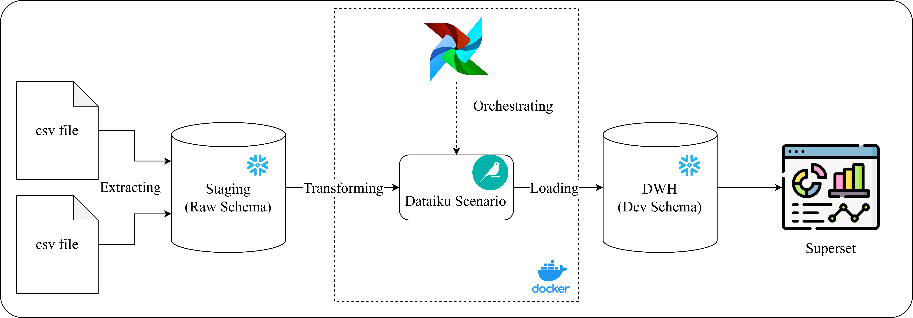
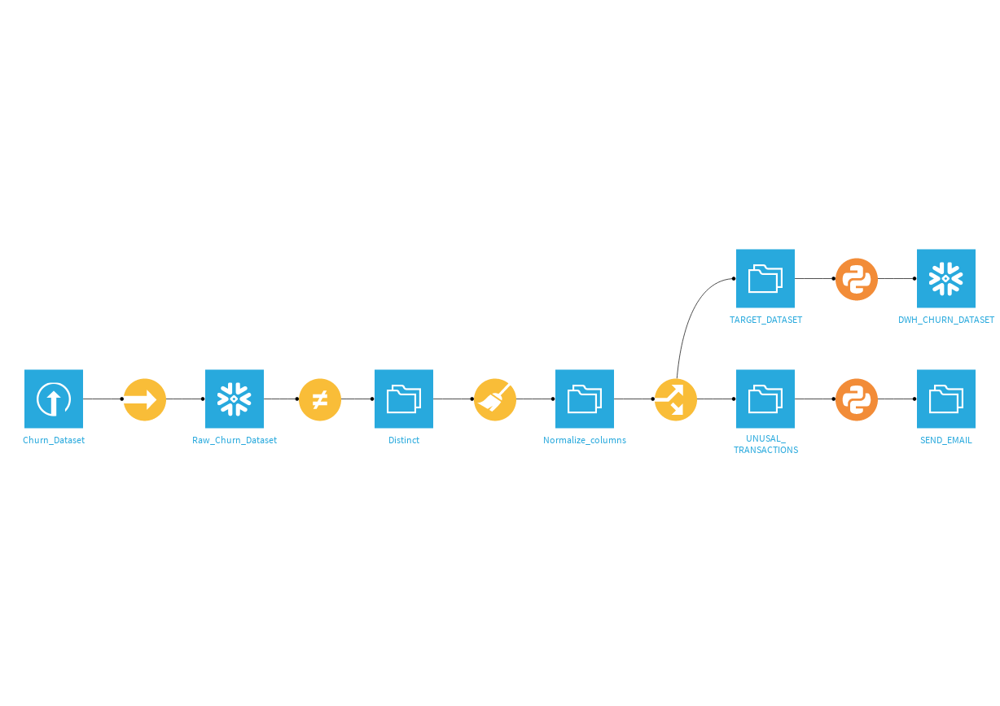
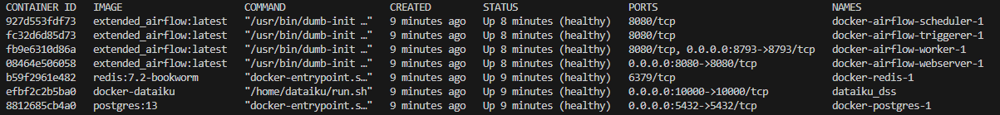
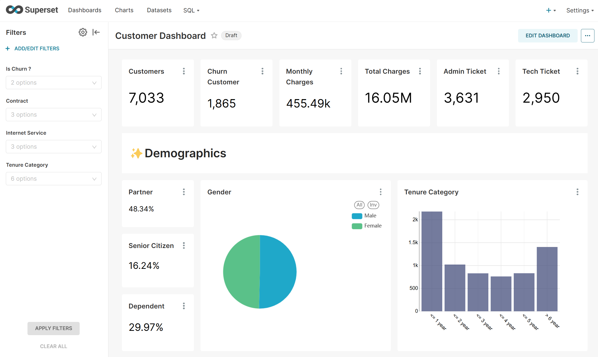
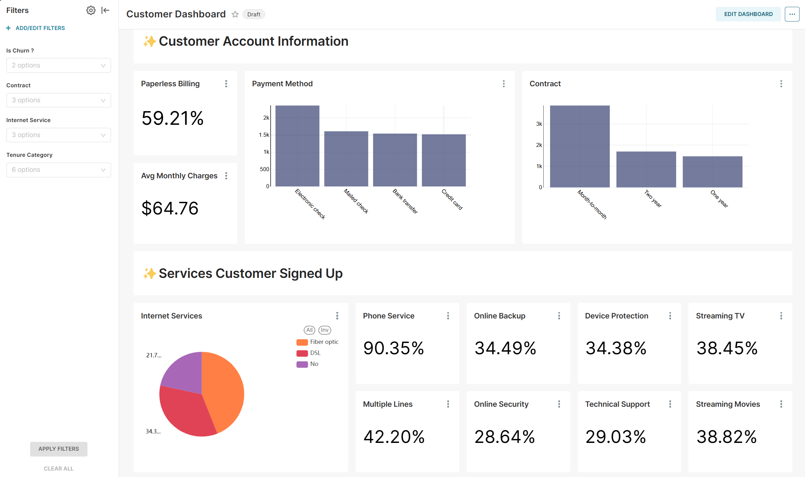

# Trigger_Dataiku_Scenario


This project is designed to demonstrate the data interaction process between Dataiku and Snowflake, with the Dataiku Scenario being orchestrated by Airflow
Dataiku Project overview

### The project is structured as follows:

Step 1: Data Integration
- Data from CSV files will be ingested into the Staging layer, stored in the Raw_Churn_Dataset table within the Raw Schema, to facilitate the data transformation process

Step 2: Data Transformation
- The raw data will be cleaned by removing duplicate records and standardizing data fields

Step 3: Data Loading
- The cleaned data will be incrementally updated into the DWH_Churn_Dataset table within the Dev Schema in Snowflake
- Records with unusual transaction volumes will trigger email alerts

---
# Running the project
To successfully run this project, follow the steps outlined below

### Prerequisites
If you are using Linux or MacOS, please install Docker and Docker Compose. If you are using Windows, please install Docker Desktop

### Setup and Configuration
1. Clone the repository
```git
git clone https://github.com/Gnoud2411/Trigger_Dataiku_Scenario.git
```

2. Navigate to the project directory
```bash
cd Trigger_Dataiku_Scenario
```
3. Create Volume for Dataiku Service
```docker
docker volume create dataiku_volume
```
4. Navigate to ./docker/dataiku Folder and Restore Volume of Dataiku service on your machine
```docker
docker run --rm -v dataiku_volume:/volume -v $(pwd):/backup ubuntu bash -c "cd /volume && tar xzvf /backup/dataiku_volume_backup.tar.gz --strip 1"
```
5. Return to the ./docker directory and initialize the Airflow-init Service to check and create the necessary initial settings
```docker
docker compose up airflow-init
```
6. Start all Services
```docker
docker compose up -d
```
7. Use the *docker ps* command to check the status of the services. Since some services are quite heavy, please wait 3-5 minutes for the startup process to complete
```docker
docker ps
```



### Output Dashboard


